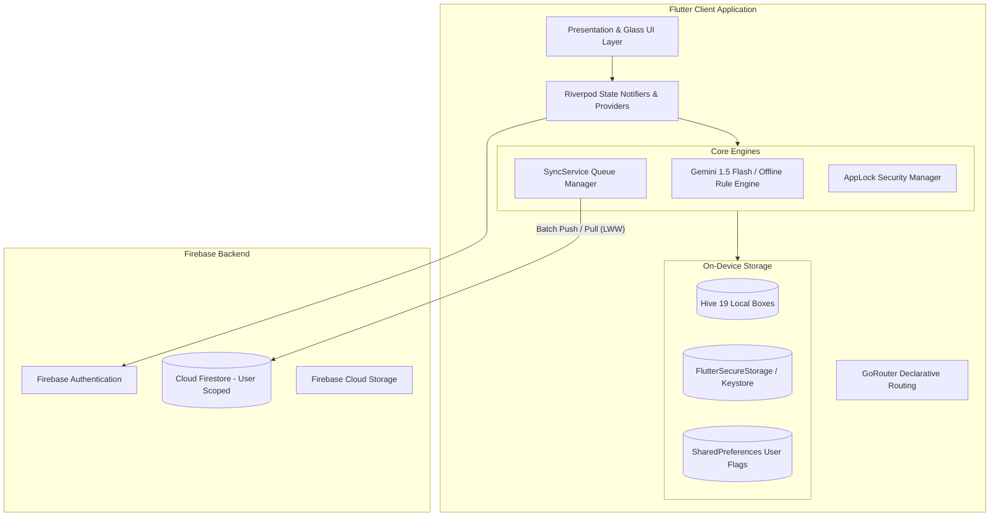

# TrackX Architecture & Technical Specification

> **Track Smarter. Plan Better.**

This document outlines the system architecture, offline-first synchronization engine, local database topology, cloud security model, and component layout for the **TrackX** application.

---

## 1. System Topology



---

## 2. Layered Architecture

TrackX follows a **Feature-First Architecture** partitioned into 19 isolated domains under `lib/features/`:

```
lib/features/<feature_name>/
├── data/
│   ├── repositories/    # Hive / Firestore persistence access
│   └── services/        # Third-party, OCR, and AI interfaces
├── domain/
│   ├── models/          # Immutable entity models & serialization
│   └── validators/      # Business logic validation rules
├── presentation/
│   ├── screens/         # Top-level view routes
│   └── widgets/         # Domain-specific modular sub-components
└── providers/           # Riverpod StateNotifierProviders
```

---

## 3. Offline-First Synchronization & Conflict Resolution

### 3.1 Write Flow (Optimistic Local-First)
1. Any user action (e.g., logging attendance, updating timetable, editing a note) writes directly to the local Hive box.
2. A `SyncOperation` is enqueued into `px_hive_sync_queue` with a unique ID and `updatedAt` timestamp.
3. If internet connectivity is detected by `connectivity_plus`, `SyncService.triggerSync()` is triggered immediately.

### 3.2 Conflict Resolution: Last-Write-Wins (LWW) with Field Merge
When pulling remote updates or resolving multi-device synchronization:
* Every entity record maintains an `updatedAt` / `updatedTimestamp` (in UTC milliseconds).
* **Remote Wins Condition**: If `remoteRecord.updatedAt >= localRecord.updatedAt`, the remote state replaces local fields via field-level merge (`Map.addAll`).
* **Local Wins Condition**: If local changes have a newer timestamp, the local record is preserved and pushed back to the server on the next sync cycle.

### 3.3 Exponential Backoff & Fault Tolerance
* Failed push requests (due to transient network timeouts or dropped connections) increment `retryCount` on the queued `SyncOperation`.
* Operations failing more than 5 times are marked `status: 'failed'` and surface in the `syncStatusProvider` for user visibility, preventing infinite retry loops.

---

## 4. On-Device Storage Topology (Hive)

The app maintains 19 distinct local Hive boxes to guarantee instant sub-millisecond read/write operations:

| Hive Box Name | Entity Description |
| :--- | :--- |
| `px_hive_semesters` | Academic semesters, date ranges, credit targets |
| `px_hive_subjects` | Subjects, syllabus, faculty tags, attendance criteria |
| `px_hive_attendance` | Daily attendance log records and proxy class markers |
| `px_hive_timetable` | Weekly period grid and room mappings |
| `px_hive_tasks` | Productivity tasks, priority levels, checklist items |
| `px_hive_assignments` | Homework, submissions, due dates |
| `px_hive_exams` | Examination dates, weightage, syllabus units |
| `px_hive_notes` | Subject-linked rich notes, tags, favorite stars |
| `px_hive_study_sessions` | Focus timer logs, Pomodoro metrics |
| `px_hive_cgpa` | Course grades, SGPA/CGPA simulations |
| `px_hive_holidays` | Academic calendar holidays and schedule overrides |
| `px_hive_sync_queue` | Enqueued sync operations awaiting Firestore push |
| `px_hive_metadata` | Local sync checkpoints and profile metadata |
| `px_hive_programmes` | Degree programme definitions and curriculum structure |
| `px_hive_dependencies` | Prerequisite and corequisite dependency graph links |
| `px_hive_scenarios` | Future semester target GPA simulation scenarios |
| `px_hive_courses` | Multi-year elective and mandatory course catalogue |
| `px_hive_topics` | Syllabus topic completion and mastery tracking |
| `px_hive_resources` | Academic file links, past papers, and study references |

---

## 5. Security & Authentication Architecture

1. **Hardware-Backed Keystore / Keychain PIN Storage**:
   * Application security PINs are stored exclusively using `FlutterSecureStorage` (`encryptedSharedPreferences: true` on Android, `KeychainAccessibility.first_unlock` on iOS).
   * Plaintext PINs in `SharedPreferences` are prohibited and purged automatically.
2. **Rate Limiting & Lockout**:
   * 5 consecutive failed PIN attempts trigger a mandatory 30-second lockout timer to protect against brute-force attacks.
3. **Firestore Security Rules**:
   * Strict user-level path scoping (`request.auth.uid == userId`) enforced on all reads and writes across `/users/{userId}/**`.
4. **AI Safety & Key Protection**:
   * Gemini 1.5 Flash uses compile-time `--dart-define=GEMINI_API_KEY=...` or user-supplied settings keys, with fallback to an on-device rule engine when offline.

---

## 6. Build & CI/CD Pipeline

Automated GitHub Actions (`.github/workflows/flutter_ci.yml`):
* `flutter pub get`
* `flutter analyze`
* `flutter test --coverage`
