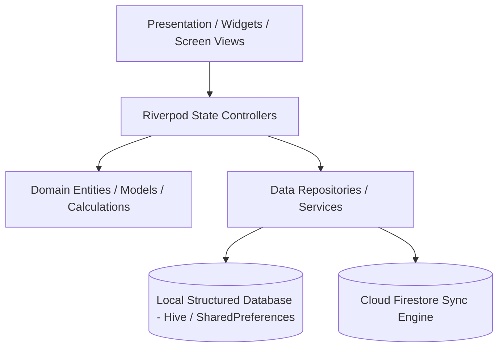

# TrackX Architecture & Data Flow

TrackX is structured using a feature-first architectural pattern, isolating modules by concern.

## Architecture Layers

## Central Modules

1. **Academic System**: Deterministic attendance stats calculations, risk alerts, and timetable slots.
2. **Productivity Suite**: CGPA forecasting, task tracking lists, and horizontal planner calendars.
3. **Cloud Sync**: Centralized connectivity observers pushing transactions queues offline-first and downloading updates using LWW conflict merges.
4. **AI Advisor**: Extracts minimal context summaries using privacy preferences to suggest tips.
