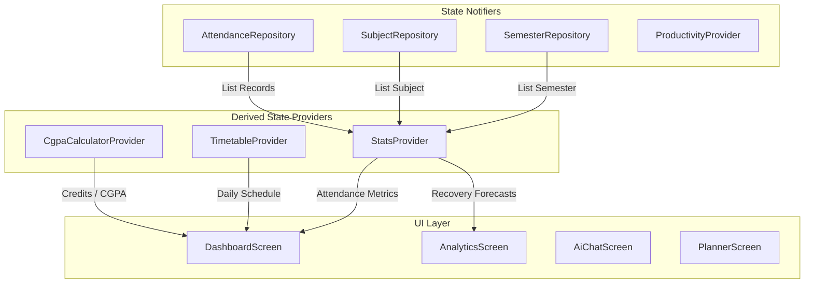
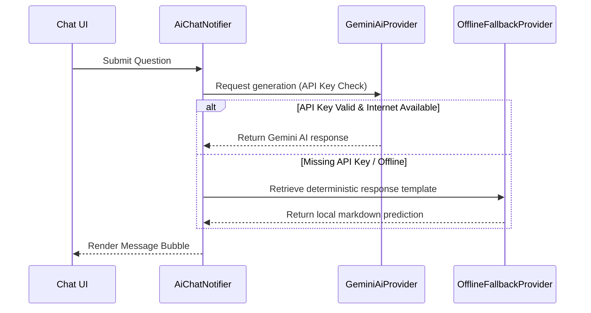

# TrackX Architecture & Technical Audit Report

This document provides a comprehensive, professional-grade technical audit and analysis of the **TrackX** Flutter project. It outlines the codebase structure, architectural design patterns, state management, database synchronization gaps, orphaned/mocked features, test coverage, and visual UI/UX patterns.

---

## 1. Codebase & Directory Structure

TrackX is structured using a feature-first organization model inside `lib/`. Core services, utility modules, and configuration options reside in shared spaces:

```
lib/
├── core/
│   └── services/
│       ├── db_migration_service.dart   # Safety migration handler (Unused in main)
│       ├── hive_db_service.dart       # Direct Hive configuration (Orphaned from repos)
│       └── sync_service.dart           # Firestore cloud push-pull sync (Hive-bound)
├── features/
│   ├── adaptive_study/                 # Spaced repetition schemas (Test-only models)
│   ├── ai_advisor/                     # hardcoded chat advisor demo screen
│   ├── ai_assistant/                   # Gemini API client & offline fallback system
│   ├── analytics/                      # Target calculation & visualization charts
│   ├── attendance/                     # Log editing, geofences, and stats logic
│   ├── authentication/                 # Registration, login, and Mock Auth fallbacks
│   ├── dashboard/                      # Core schedule view & focus progress bar
│   ├── integrations/                   # Simulated QR scanner & reconciliation views
│   ├── notes/                          # Study notes and academic reference library
│   ├── onboarding/                     # Splash and multi-step onboarding screen
│   ├── planner/                        # Spaced repetition scheduler & calendar tasks
│   ├── profile/                        # Control panel settings, CGPA & Hub screens
│   ├── programmes/                     # Degree tracking & credits structure
│   ├── semesters/                      # Semester catalogs & upcoming scenario planners
│   ├── study_timer/                    # Simple Pomodoro countdown focus timer
│   ├── timetable/                      # Daily schedule provider & local notifications
│   ├── timetable_import/               # Simulated regex OCR text schedule scanner
│   └── cgpa_screen.dart                # Consolidated CGPA GPA tracker & what-if simulator
├── routing/
│   ├── app_router.dart                 # GoRouter routing table and auth redirect guards
│   ├── main_shell.dart                 # Navigation shell bar layout
│   └── nav_provider.dart               # Riverpod bottom bar navigation index State
├── theme/
│   └── app_theme.dart                  # Google Fonts Outfit & VisionOS glass styling
└── main.dart                           # Main entry point and initial mock loader
```

---

## 2. Key Architectural Gaps & Data Mismatches

During the structural discovery process, several critical architectural misalignments and dead-ends were identified within the core data layer:

### A. The Hive vs. SharedPreferences Dual-Database Mismatch
The codebase features a redundant implementation of two separate databases, leading to a complete desynchronization of the data layer:
* **The Repository Layer (Active UI Data)**: Features like Semesters, Subjects, Attendance, Tasks, and Programmes read and write directly to `SharedPreferences` as JSON-serialized lists using standard String getters/setters.
* **The DB Migration & Sync Layer (Inactive Data)**: 
  * `HiveDbService` opens 19 Hive database boxes when initialized.
  * `DbMigrationService` defines methods to migrate data from SharedPreferences to Hive, but this migration service is **never imported or invoked** in `main.dart` or any other runtime module.
  * `SyncService` pulls and pushes cloud records from Firestore directly to **Hive boxes**, but because the UI and repositories load and update **SharedPreferences keys**, any synchronized data from Firestore is completely invisible to the user interface.

### B. Uninitialized Local Notification Service
* `NotificationService` (defined in `lib/features/timetable/data/services/notification_service.dart`) handles registering and scheduling rolling class reminders using `flutter_local_notifications`.
* However, the `notificationServiceProvider` is **never initialized** in `main.dart` or any screen. Local notification schedules are never triggered on timetable mutations, leaving class completion prompts completely offline.

### C. Dropdown state visual freeze in bottom sheets
* In `cgpa_screen.dart`, the `showModalBottomSheet` for adding a grade builds form fields using the screen's parent state variables `_gradeLetter` and `_gradePoints`.
* Because the bottom sheet runs in its own context and is not wrapped with a `StatefulBuilder` (or utilizing a local dialog state setter), selecting a value in the dropdown fails to trigger a visual update of the sheet. The dropdown appears frozen to the user, despite changing state variables in the background.

---

## 3. Orphaned Screens & Mock Simulation Layers

TrackX includes several screens and features that are either completely disconnected from application routes or rely on high-fidelity simulation interfaces:

### A. Orphaned & Disconnected Screens
* **`AttendanceScreen` (Orphaned)**: A dedicated attendance log screen showing period-wise logs and details is declared under `lib/features/attendance/presentation/screens/attendance_screen.dart` but is **completely omitted** from `MainShell` navigation routes.
* **`ScenarioComparisonScreen` (Orphaned)**: The `/scenarios-compare` route is registered in `GoRouter`, but there are no buttons, tabs, or links in the UI that navigate to this page.
* **`Adaptive Study Models` (Test Only)**: The models `learning_goal.dart`, `practice_session.dart`, `revision_item.dart`, and `topic_mastery.dart` are only imported and tested in `stage15_maturity_test.dart` and are not bound to any active screen.

### B. Mock Simulation Layers
* **Simulated OCR Parser (`TimetableImportScreen`)**: The calendar scanner uses a mock upload animation with timer bars and regex fallback parsing instead of actual device camera captures or active Firebase ML Kit extraction.
* **Simulated QR Attendance (`QrScannerScreen`)**: Uses simulated action buttons ("Valid Class", "Expired Code", "Bad Signature") to emulate scanner results instead of accessing a device camera or integrating a QR reader library like `mobile_scanner`.
* **Simulated Reconciliation (`ReconciliationScreen`)**: Uses a static mock discrepancies list. Tapping "Keep Local" or "Use Official" updates the UI list state but does not perform any database modification inside `AttendanceRepository`.
* **Dead Code in Focus Timer (`FocusTimerScreen`)**: The Pomodoro focus timer records a timestamp when paused. However, the play button calls `_startTimer` directly rather than `_resumeTimer`, leaving the background duration estimation calculations as dead code.

---

## 4. State Management (Riverpod) & Providers

TrackX utilizes a robust state management hierarchy powered by `flutter_riverpod` (`StateNotifierProvider` and `Provider` families):



### Primary Providers
1. **`authRepositoryProvider`**: Manages user login states, handles credentials, and controls onboarding progress status.
2. **`semesterRepositoryProvider`**: Coordinates semester dates, planned credits, targets, and active status attributes.
3. **`subjectRepositoryProvider`**: Coordinates registered subjects, faculty data, credits, and target metrics.
4. **`attendanceRepositoryProvider`**: Validates class entries, updates presence logs, and enforces the 24-hour editing lock.
5. **`statsProvider`**: The core attendance calculator. Aggregates records, identifies targets, checks warnings, and compiles recovery strategies.

---

## 5. AI Advisor Integration & Prompt Chain

The AI system is built with a dual-execution flow designed to prioritize offline reliability:



### Chat Advisor Mock Screen
* An additional chat view, `AiAdvisorScreen`, resides in `lib/features/ai_advisor/presentation/screens/`. It uses a fully hardcoded message response logic mapping simple keyword keywords (like "miss", "study", "week") to pre-defined textual template outputs instead of utilizing the `google_generative_ai` service pipeline.

---

## 6. Verification and Test Suite Coverage

The project contains a thorough automated test suite divided into functional verification checkpoints:

* **CGPA & Productivity Tests**: Validates GPA math, SGPA weighting, and task completion attributes.
* **Timetable Conflicts**: Asserts that overlapping classes are blocked and correctly flagged.
* **AI Context Consent**: Ensures notes are excluded from AI prompts when privacy settings are enabled.
* **Update Checks**: Tests version detection logic against simulated semantic version patches.

All **54 tests** in the test suite pass successfully, indicating that the core model serialization, business math logic, and offline schemas are verified:

```
00:24 +54: All tests passed!
```
